# Financial documents parsing examples with various different libraries

There is so much data into the `pdfs` that we store but for other purposes like training the machine learning model we can not use that data directly from `pdfs`. This is really one of the issue when we have to work with financial data as most of the companies works with `pdfs` to store their P&L, tax returns, general meeting notes and much more. Even the broachers of the companies are into `pdfs`. In order to study more about the companies we need some way to extract this data efficiently and precisely. Here we would like to show our research and work around how to get the data from `pdfs`.

There are some libraries already created, open sourced for doing such extractions. Let's see in depth some of them.

### 1. PDFToText:

If the pdf is not made out of images this library is one of the best to use. It is really easy to use and can convert the pdf data into simple raw text very precisely. Let's see some samples of this.
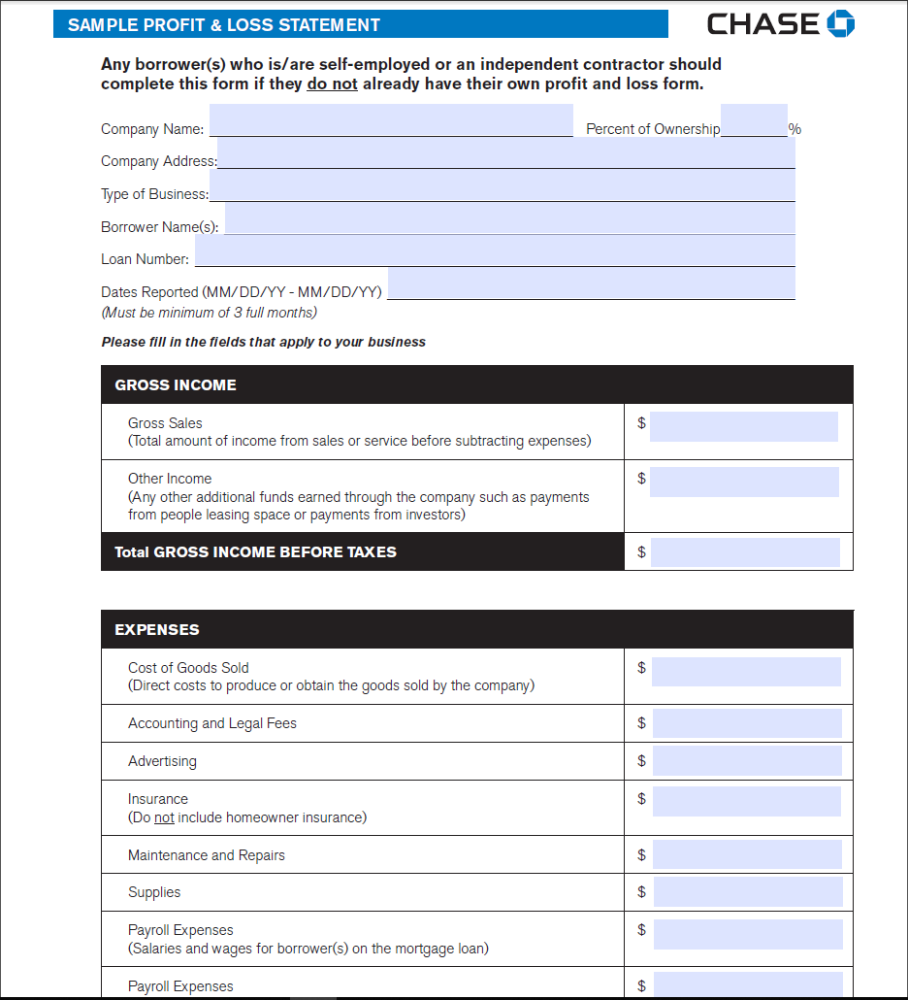

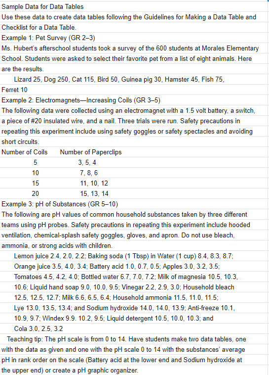


In the above two pictures, the first one is the image of the pdf file and the second one is of the `csv` file that is generated from by the `pdftotext` library. The example taken is to show the capability of the library to extract the tables and data at the same time in meaningful way. After that anyone can apply regular extractions to get the most out of the data from the csv file. We have added some files in `data` folder as examples.

You can use the sample code that we have used from `code` folder. Do following to use that

1. Change the name of the `pdf` file path at the line 5 from `./data/sample_file.pdf` to your desired file path.
2. Change the name of the output file at the line line 16 from `./data/sample_csv.csv` to your desired file path.
3. Run file `pdftotext_sample.py` from the terminal using `python pdftotext_sample.py` command.

    Requirements to use `pdftotext` are:
     1. OS - Linux
     2. Python >= 3.0
    Here is the package link on pypi https://pypi.org/project/pdftotext/.

### 2. Tesseract

PDF2Text can extract data from `text PDF`, where as it will fail for extracting data from `image PDF`. In real world scenario one can get any kind of PDFs, so one needs to use `Optical character recognition` (OCR) libraries which are meant for this. Tesseract is one of the best example of it. Let us understand it with these samples:

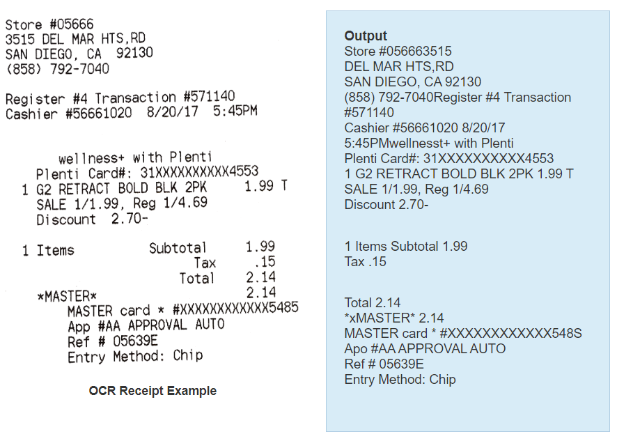

In the above picture we can see how information is extracted. The lest most is the a receipt and the left most is the output which one gets after applying tesseract onto it.

    Requirements to use `tesseract` are:
     1.  1. OS - Linux, Mac OSX and Windows
     2. Python 2.7 or 3.5+
    Here is the package link on pypi https://pypi.org/project/pytesseract/

### 3. Invoice2Data

Invoice2Data library can used not just only to extract data from PDF but also get information from that extracted data. Both the above libraries can be used for their specific usage, where as `Invoice2Data` provides ability to extract data with any of the above mentioned (and also more) libraries. It extracts the data from the PDF and then using the templates one can get the desired information out of it. Below is shown a sample of how it works:

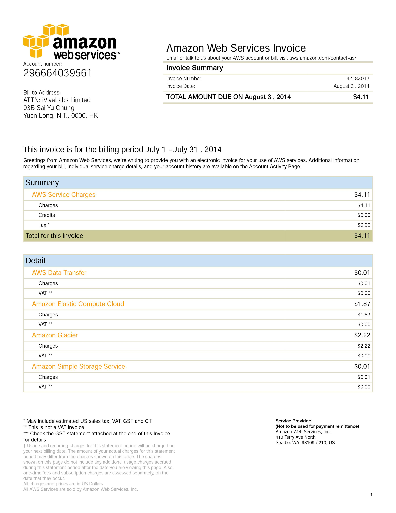

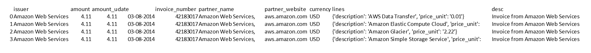


The first image is the PDF of AWS receipt, and the second is the extracted information in form of CSV data. For more information on how to use Invoice2Data and how templates work, review it's [GitHub repository](https://github.com/invoice-x/invoice2data)


    Requirements to use `invoice2data` are:
     1. OS - Linux
     2. Python >= 3.0
    Here is the package link on pypi https://pypi.org/project/invoice2data/0.0.1/

### 4. Pdfminer.six

Pdfminer.six is a community maintained fork of the original PDFMiner. It is a tool for extracting information from PDF documents. It focuses on getting and analyzing text data. Pdfminer.six extracts the text from a page directly from the sourcecode of the PDF. It can also be used to get the exact location, font or color of the text.

It is build in a modular way such that each component of pdfminer.six can be replaced easily. You can implement your own interpreter or rendering device to use the power of pdfminer.six for other purposes that text analysis.

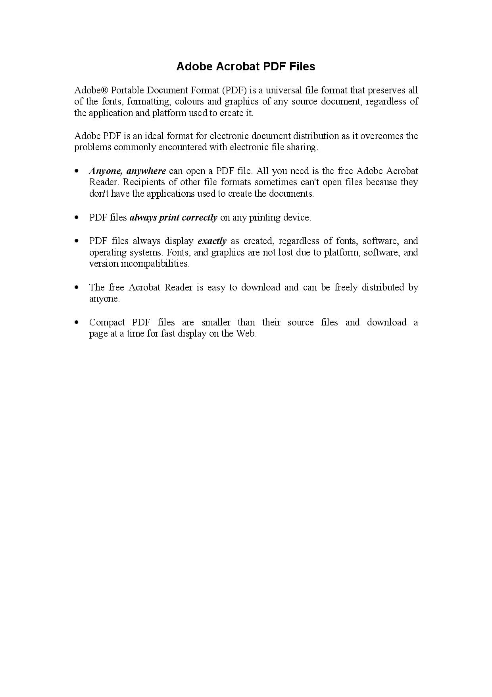
Result:
```
Adobe Acrobat PDF Files
Adobe® Portable Document Format (PDF) is a universal file format that preserves all
of the fonts, formatting, colours and graphics  of any  source document,  regardless of
the application and platform used to create it.
Adobe PDF is an ideal format for electronic document distribution as it overcomes the
problems commonly encountered with electronic file sharing.
•  Anyone, anywhere can open a PDF file. All you need is the free Adobe Acrobat
Reader.  Recipients  of  other  file  formats  sometimes  can't  open  files  because  they
don't have the applications used to create the documents.
•  PDF files always print correctly on any printing device.
•  PDF  files  always  display  exactly  as  created,  regardless  of  fonts,  software,  and
operating systems. Fonts, and graphics are not lost due to platform, software, and
version incompatibilities.
•  The  free  Acrobat  Reader  is  easy  to  download  and  can  be  freely  distributed  by
anyone.
•  Compact  PDF  files  are  smaller  than  their  source  files  and  download  a
page at a time for fast display on the Web.
```


    Requirements to use `pdfminer.six` are:
     1. Python >= 3.4

    Insall:
     1. pip install pdfminer.six

 ### 5. Pytessereact - Extracting information from KYC document

 Pytessereact is trained on different languages.If the document has different languages then we need to train the pytessereact and if image is not clear or visible then we need to use some image processing techniques like thresholding,opening,border detection.

 ### Driving Licence:
 Here we have fetched data from UK sample licence using this library.

 

Result:

```
DRIVING LICENCE
1, MORGAN
2, SARAH
MEREDYTH
3. 11.03.1976 UNITED KINGDOM
4a. 19.01.2013 4c. DVLA
4b. 18.01.2023
5. MORGA753116SM9lJ 35
8. 122 BURNS CRESCENT
EDINBURGH
EH1 9GP.
9. AM/A/B1/B/f/kK/I/n/p/q
DVLA INTERNAL USE
```
 ### Marksheet:

One more example is below for the Pytessereact. Here we are extracting data from marksheet for engineering student. The original image for the same is as below

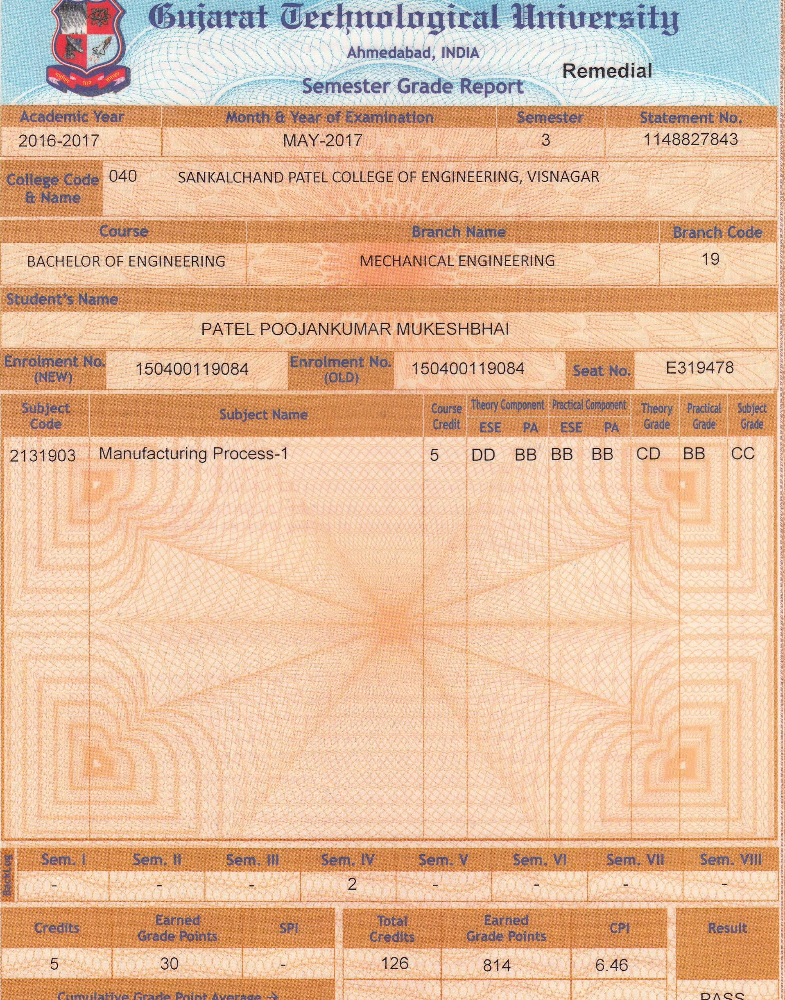

From the above image, the extracted data is as below
```
Academic Year             Month & Year of Examination      Satement No.
2016-2017                      MAY-2017                      1148827843

Course Code &        040    SANKALCHAND PATEL COLLEGE OF ENGINEERING, VISNAGAR
Name

       Course                           Branch Name
BACHELOR OF ENGINEERING           MECHANICAL ENGINEERING

Student's Name
          PATEL POOJANKUMAR MUKESHBHAI

Enrolment No(NEW) 150400119084   Enrolment No(OLD) 150400119084    Seat No. E319478

Subject
Code               Subject Name         Course  Theory Component Practical Component Theory Practical Subject
                                                ESE PA            ESE PA              Grade   Grade   Grade
                                        Credit
2131903     Manufacturing Process-1      5      DD  BB     BB BB     CD    BB    CC
```

We can see that some of the information is still missing as that is due to the color schema of the image. But, with proper image processing like converting image to black and white it is possible to sovle such issues and get perfect results.

 ### Income Tax Return (ITR)

 Below is small example on ITR. Due to size of image we could not show the full image of ITR but as you can see below the small excerpt of ITR and how the model is able to get the data as it is from the image.

 

```
Name
PAN                           |        AY:   2020-21          |         DIN  : CPC/2021/A1/105231128            |    Ack. No.  : 439435200030820


 SI.No.      Particulars             Reporting Heads                                                                                              Amount  in =
                                                                                                            As provided by Taxpayer As Computed u/s 143(1)

 01           SALARY
                                    (i) Gross  salary (iatibtic)                                         7,83,867                7,83,867
                                            (a) Salary as per section  17(1)                             7,83,867                7,83,867
                                            (b) Value  of perquisites as per section 17(2)               0                       0
                                            (c) Profits in lieu of salary as per sec 17(3)               0                       0
                                    (ii) Less : Allowances  to the extent exempt  u/s 10                 42,037                  42,037
                                    (iii) Net salary (i-ii)                                              7,41,830               7,41,830
                                    (iv) Deduction  u/s 16 (ivativbtive)                                 52,400                  52,400
                                            (a) Standard  deduction  u/s 16  (ia)                        50,000                  50,000
                                            (b) Entertainment  allowance   u/s 16 (ii)                   0                       0
                                            (c) Professional  tax 16(iii)                                2,400                   2,400
                                    (v) Income  chargeable  under the head ‘Salaries’ (iii-iv)	         6,89,430               6,89,430
```

 As you can see the data is preserved properly and in a way where we can do further processing and apply logic as per need of the system.

### Stock Research Reports

So many institutes publishes research report every quarter on stock. Many hedge fund managers read those reports in order to make decisions on if they should invest in such stocks or not. This gave us very interesting problem where we parsed many stocks reports published by different institutes for same campany and analyze them to make one generalized report for managers. We have already working prototype where we can extract information like Target Price, Published Date, Action and so on. We are also able to extract different tables presents in such reports to show user how on average stock is performing as per different institutes.Below is just small snippet from such report and we have shown that we are able to get details like Stock Name, Date, Action, Target Price and so on. There is complext logic and modeling workflow behind it which we can not show here.

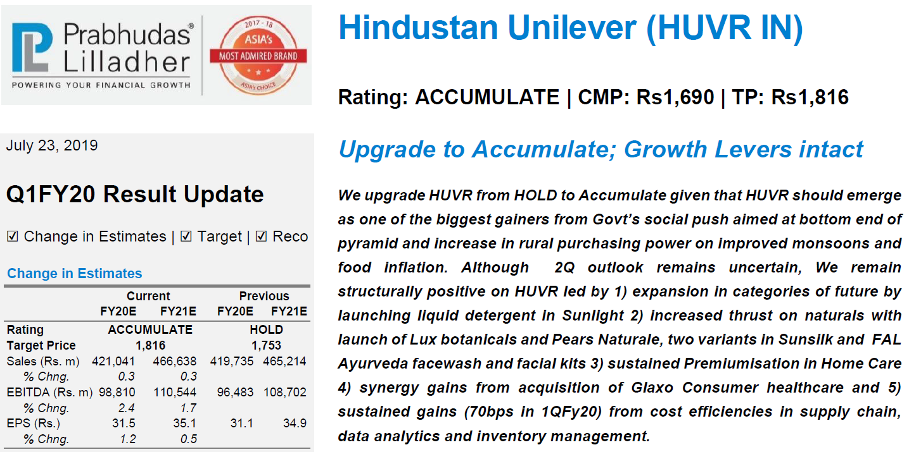

Here is the ouput for above image from our system

```
file_name,companyName,action,date,targetPrice,currentPrice
HUVR-23-7-19-PL.pdf,hindustan unilever,accumulate,July 23 2019,accumulate,1816,1690
```

As you can see our system accurately tells most important data from stock research reports out of the box.

We have applied OCR techniques to many other financial use cases and documents and have achived state of the art results.

## Best Practices around - Name/address matching, quality of documents, Deduplication of photos

There are many things we need to do after we get the data out of the documents. Some of the challanges for the same are listed below and we will show some best practices for the same.

    1) Name matching - I.e. a)  Urvish Patel vs Urvish P.  b) Urvishkumar Patel vs Urvish Patel
    2) Address matching across documents where address entered might be slightly different
    3) Deduplication of photos/documents
    4) How to check the quality of the documents I.e. borders, lighting etc.

To solve above issues we can have following solution.

1. Name matching - I.e. a)  Urvish Patel vs Urvish P.  b) Urvishkumar Patel vs Urvish Patel

    There are algorithms specifically designed to solve this problem. They are measures how much similarity is there between two words and hence give us the idea if texts are same or different.

    Two such algorithms are

    A.) Levenshtein Distance

    Minimum number of single-character edits required to change one word into the other

        Insertions
        Deletions
        Substitutions

        Ex:
        “kitten” and ”sitting” has edit distance = 3
        kitten → sitten → sittin → sitting

    This is one of the most famous algorithm used for string matching problems.


    B.) Jaccard Method

    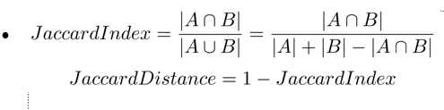

    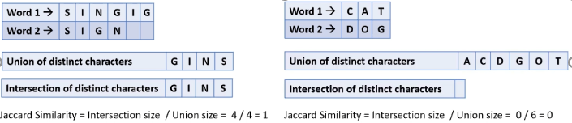

    The above two are the most used methods when it comes to string matching use cases.

2. Address matching - This is more or less same case as above where we try to match two strings. So for this problem as well, we can use the fuzzy logic algorithms as Jaccard Method to compute the similarity.

3. Deduplication of photos/documents - There are various deep learning algorithms now which can help us in identifying duplicate documents or if the documents are the same or not.

    A.) Metric Learning:- This is considered as the state of the art method where we learn the representation of image just like what we learn in facial recognition models.
    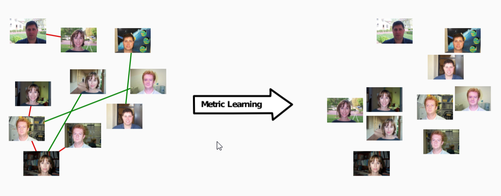

    B.) Embedding Learning:- Embeddings are representations of the words in the context of NLP, however, we can use them for learning the representation of the images and can compute a similarity between images based on the vector representation of original and duplicate images.

4. How to check the quality of the documents I.e. borders, lighting etc

    A.) Fast Fourier Transform: -
    There are several ways to check the quality of an image. We can use algorithms like FFT (Fast Fourier transform) which gives the idea of how much the image is blurry. Once we know the value of blur we can discard the images which are more blur and ask the user to upload them again.
    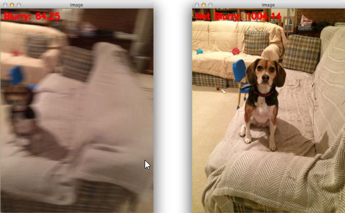

    B.) Another idea is to determine the resolution of images based on the pixel density (DPI). This can be done using many libraries like ImageMagick available in Python. If the quality of an image is 95 then it is said to be of the highest quality else not. So based on this user can be asked to upload the image again if needed.

    [Here](https://www.kaggle.com/pokekarat/classify-jpg-data-based-on-its-quality-75-90-95)  is the notebook on Kaggle created for the same purpose. The idea was to split the data based on quality to train different models. But the same idea can be applied to detect the quality of an imge.


As we can see, not just that getting document's data is important but also doing some processing on it to get the proper data is also important. We can have many other problems like duplication when it comes to documents and that is also needed to be tackled. But, with the rise of Machine Learning these problems are getting solved day by day.